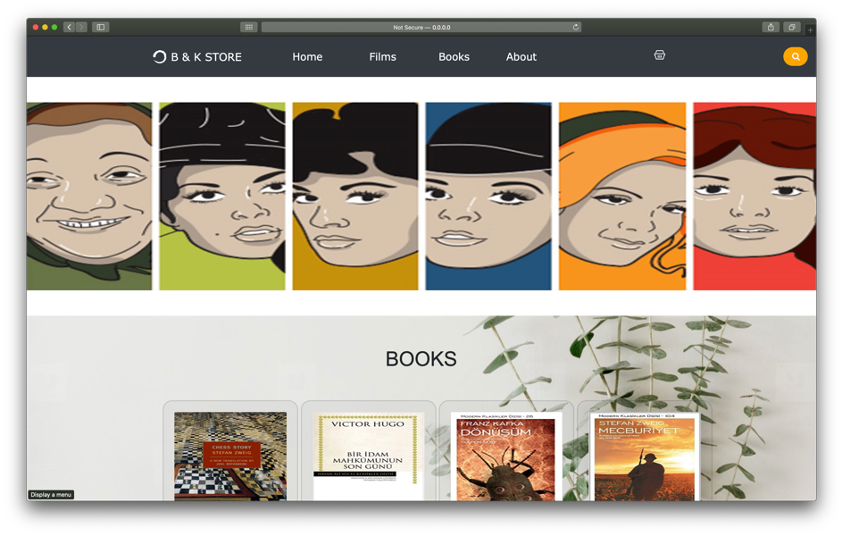
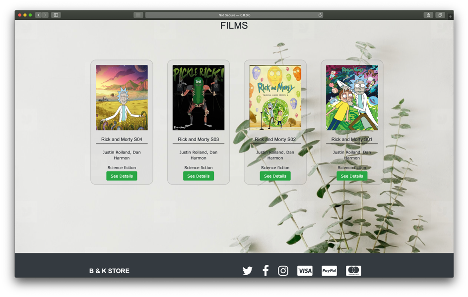
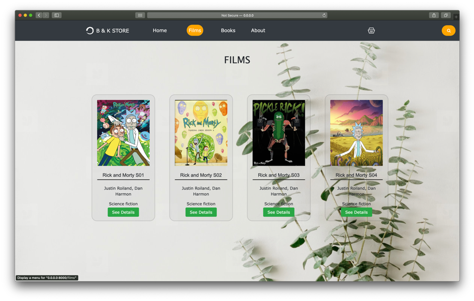
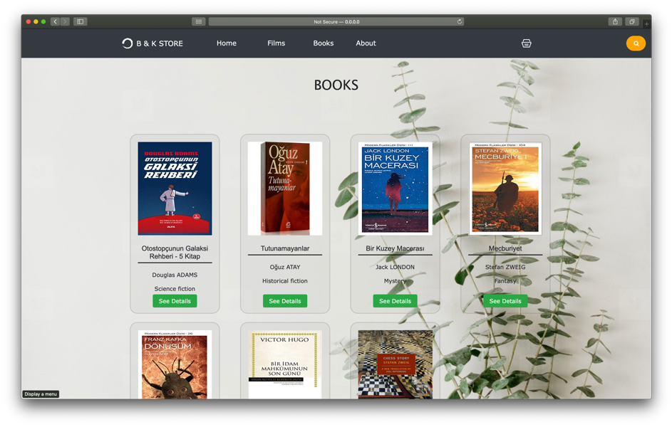
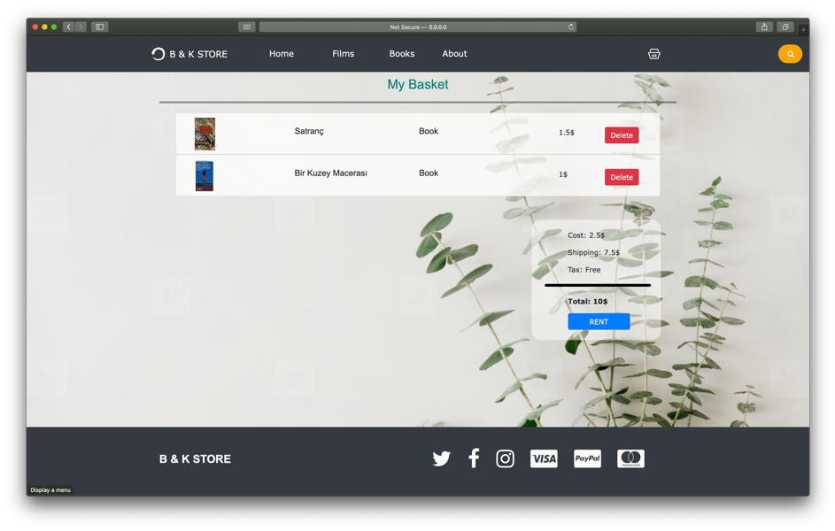
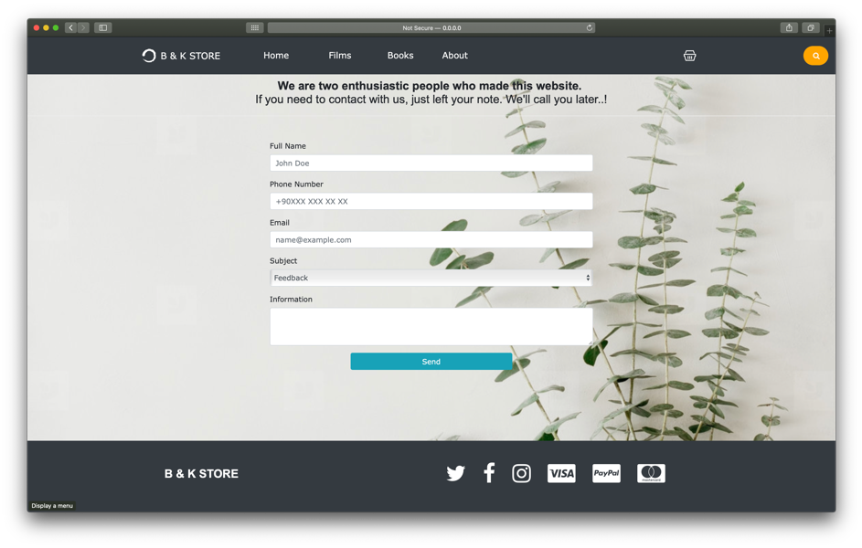
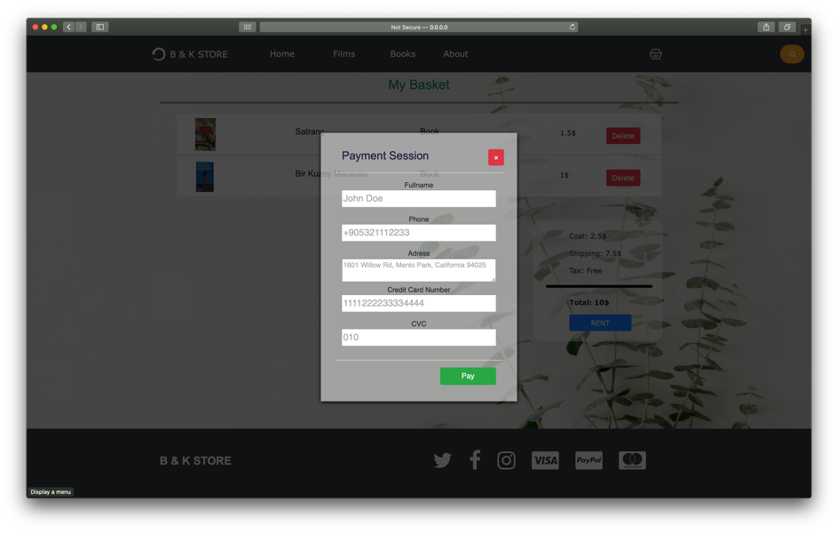
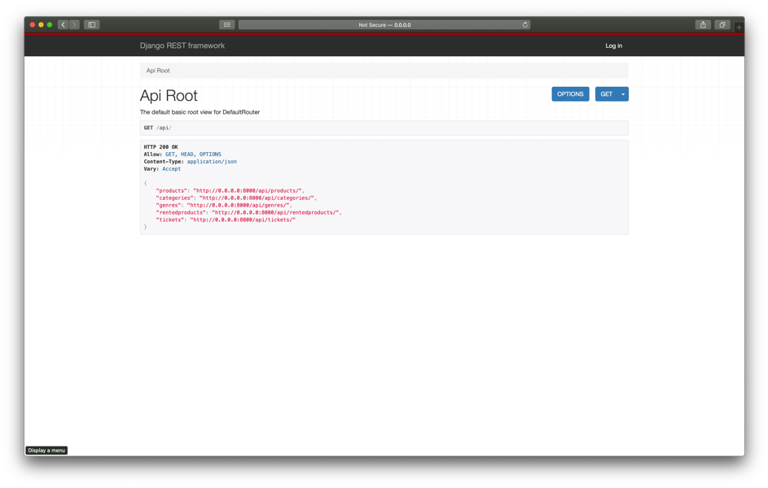
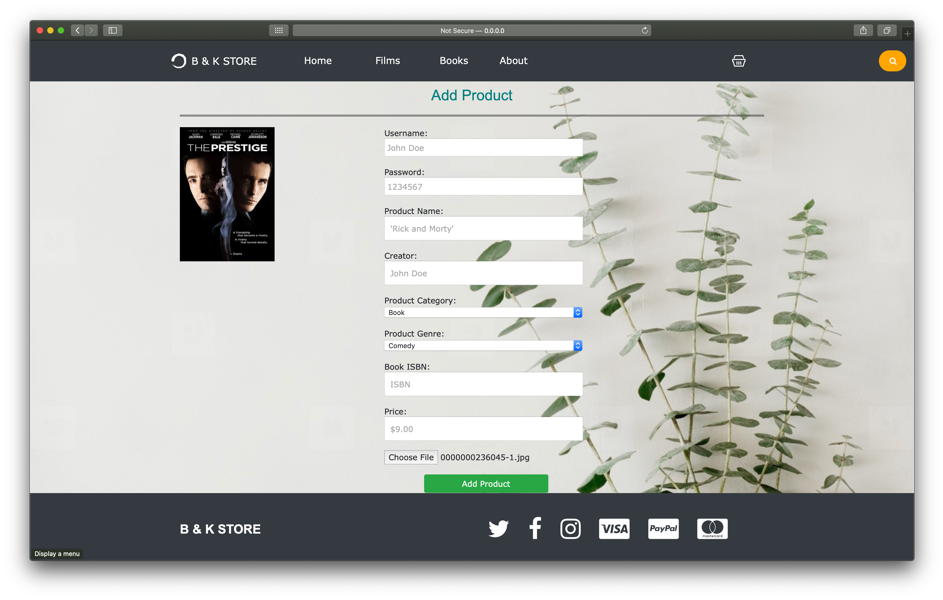
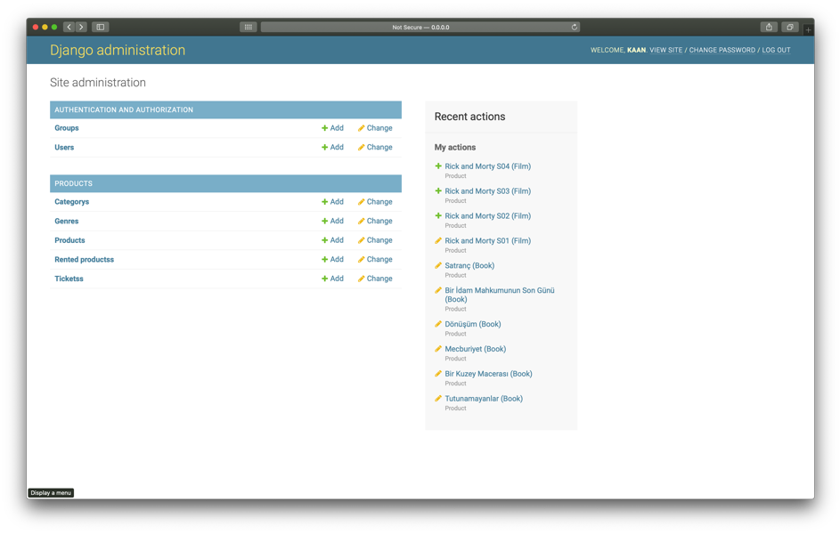

# Movie&amp;Film Renting System

It is a very first internet project of us.

# Installation

## Dependencies
*   Python                        3.7.5
*   Django                        3.0
*   django-extensions             2.2.5
*   django-extra-fields           2.0.2
*   django-rest-auth              0.9.5
*   django-rest-framework         0.1.0
*   djangorestframework           3.10.3
*   djangorestframework-simplejwt 4.4.0

```
pip install django == 3.0
pip install django-extensions == 2.2.5
pip django-extra-fields == 2.0.2
pip django-rest-auth == 0.9.5   
pip django-rest-framework == 0.1.0   
pip djangorestframework == 3.10.3  
pip djangorestframework-simplejwt == 4.4.0
```

# Run

```
cd Rent_System_Django
python manage.py
```


# Outputs











